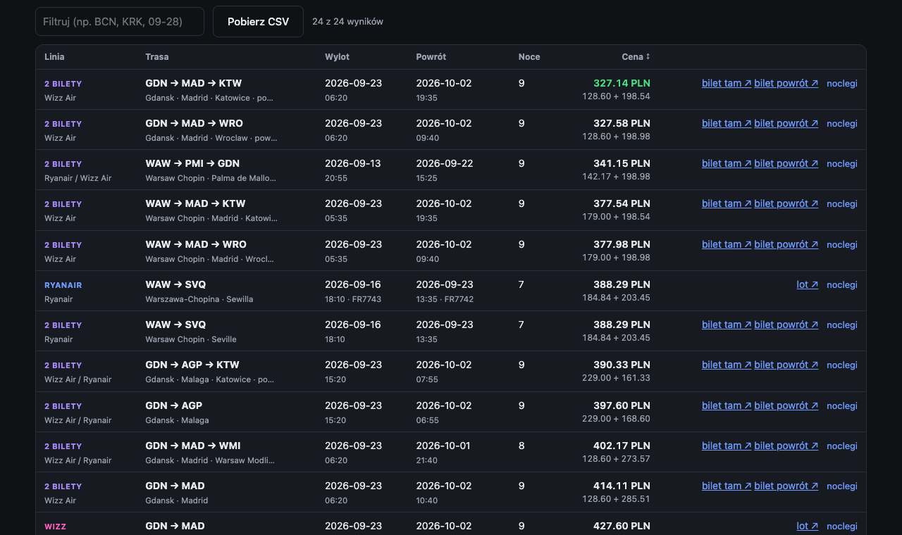
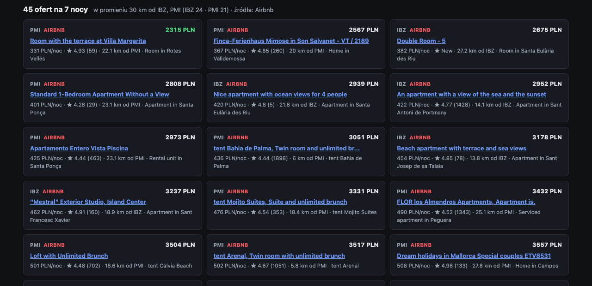

# fare-scraper

A local flight and accommodation search engine that talks to the airlines' own booking backends —
no third-party fare API, no API keys. Five carriers are scraped at the source, everything else
comes through Kiwi.com, and stays near the destination come from Airbnb and Booking.com with real
prices for the whole trip. One Python process, a stdlib HTTP server, a dependency-free frontend.

Built to answer questions the airlines' own sites make awkward: *cheapest week in September from
any Polish airport to anywhere in Spain*, *out on Wizz Air and back on Ryanair if that is cheaper*,
*fly out of Gdańsk and back into Poznań*, *leave on a Sunday or Monday, whichever is cheaper*.

[](https://github.com/Suzzzzik/fare-scraper/actions/workflows/ci.yml)




*Two-ticket combos (tagged **2 BILETY**), open-jaw returns (GDN → MAD → KTW), mixed airlines
(Ryanair out, Wizz Air back), every total in one currency with the per-leg split underneath.*

## Engineering highlights

The interesting work is not the scraping, it is what had to be reverse-engineered, measured or
debugged to make it correct and fast. Each item links to the section with the evidence.

- **Five airline backends reverse-engineered from their own sites**, each with a non-obvious
  requirement discovered by inspection rather than documentation: a header that must echo a cookie
  ([Wizz Air](#wizz-air-wizzairpy)), request fields that must be strings not numbers or the API
  returns a misleading 500 ([LOT](#lot-lotpy)), an `IataCode` parameter whose wrong spelling yields
  a wrong error message ([Ryanair](#ryanair-ryanairpy)).
- **Bot protection handled by evidence, not folklore.** Cloudflare, Akamai, Imperva and DataDome
  each got the approach that measurement showed works — and the ones that didn't are written down
  with why ([Lufthansa](#lufthansa-lufthansapy), [China Airlines](#china-airlines-china_airlinespy),
  [easyJet](#which-airlines-can-be-scraped-directly-and-which-cannot)). Reliability went from
  0 of 3 to 3 of 3 by adding a one-line stall diagnostic first and fixing what it showed.
- **A currency bug that produced confidently wrong totals** — 179 PLN + 29.99 EUR reported as
  "208.99 PLN" — fixed at the one choke point every row passes through, with an offline test that
  pins it ([One currency](#one-currency-fxpy)).
- **Three order-of-magnitude speedups by measuring instead of assuming**: rate limiters set from
  fear of throttling, blind sleeps and a serialised band walk were the entire wall time. Wizz Air
  110 s → 14.6 s, LOT 26.3 s → 4.2 s, Booking.com stays 30 s → 3.3 s cold / 1.3 s warm, same
  results ([Performance notes](#performance-notes)).
- **Concurrency done where it pays**: carriers in parallel, both combo directions at once, both
  accommodation sources at once, several destinations at once — and a thread-affinity bug in a
  browser driver fixed with a dedicated worker thread rather than a lock
  ([China Airlines](#china-airlines-china_airlinespy)).
- **Search features a single airline site cannot offer**: mixed-airline and open-jaw trips built
  from independently priced legs, weekday filtering that wraps the week, a relative price cap
  ([Search features](#search-features)).

The UI is in Polish (it was built for a Polish user); code, comments and this document are in
English.

---

## Contents

- [Engineering highlights](#engineering-highlights)
- [What it does](#what-it-does)
- [Quick start](#quick-start)
- [Architecture](#architecture)
- [Sources](#sources)
  - [Which airlines can be scraped directly, and which cannot](#which-airlines-can-be-scraped-directly-and-which-cannot)
  - [Ryanair](#ryanair-ryanairpy) · [Wizz Air](#wizz-air-wizzairpy) · [LOT](#lot-lotpy) ·
    [Lufthansa](#lufthansa-lufthansapy) · [China Airlines](#china-airlines-china_airlinespy) ·
    [Kiwi.com](#everything-else-kiwipy) · [Stays](#stays-stayspy)
- [Search features](#search-features)
- [HTTP API](#http-api)
- [Command line](#command-line)
- [Performance notes](#performance-notes)
- [Limitations, politeness, legal](#limitations-politeness-legal)
- [Development](#development)
- [Project layout](#project-layout)

---

## What it does

- **Country-to-country search** across all sources at once — pick Poland → Spain, get every
  route the selected carriers fly between them, streamed in as each carrier answers.
- **Return trips with a flexible stay** — "7 nights ± 2" searches every stay from 5 to 9 nights.
- **Two-ticket combos** — mixed airlines (out on Wizz Air, back on Ryanair) and open-jaw trips
  (out of GDN, back into POZ), built by pairing independently-priced one-way legs.
- **One currency** — carriers price each leg in its departure market's currency (PLN out, EUR
  back); everything is converted before it is added or compared.
- **Narrowing** by origin airports, destination airports, weekday of departure (with a wrap-around
  tolerance), a hard price cap, and a relative cap ("only fares within 150 % of the cheapest").
- **Accommodation with real prices** near the destination airport — Airbnb and Booking.com searched
  concurrently, one shared filter vocabulary, and a source that cannot honour a selected filter is
  skipped rather than queried unfiltered. Two ways in: **standalone at `/noclegi`** for any cities
  and any period with no flight involved (one or several destinations at once), or the **noclegi
  button on any flight row**, pre-filled with that flight's destination and dates.
- **Live UI** over Server-Sent Events, sortable, filterable, CSV export, every row linking to the
  carrier's own booking page.

## Quick start

```bash
python3 -m venv .venv && .venv/bin/pip install -r requirements.txt
.venv/bin/python server.py
```

Open <http://127.0.0.1:8000>. Flags: `--port`, `--host`, `--market` (drives the currency and the
language of place names — `pl-pl` gives PLN, `es-es` gives EUR), `--currency`.

Two sources need a real browser and are optional; without them everything else still works and the
UI says which source could not run and why:

```bash
.venv/bin/pip install playwright                          # Booking.com
.venv/bin/pip install patchright && .venv/bin/patchright install chrome   # Lufthansa, China Airlines
```

Every module is also a standalone CLI — see [Command line](#command-line).

## Architecture

```
static/index.html   flight search UI ─┐                       ┌─ ryanair.py        (own API)
static/noclegi.html stays UI         ─┤  SSE / JSON           ├─ wizzair.py        (own API)
static/app.css      shared styles     ├──────►  server.py  ───┼─ lot.py            (own API)
                                      │        SearchRun      ├─ lufthansa.py      (patchright)
                                      │        Clients        ├─ china_airlines.py (patchright)
                                      │                       ├─ kiwi.py           (aggregator)
                                      │                       ├─ stays.py          (Airbnb, Booking)
                                      └───────────────────────┴─ fx.py             (ECB rates)
```

| Module | Covers | How |
|---|---|---|
| `server.py` | HTTP server, search orchestration, SSE streaming | stdlib `http.server`, one thread per carrier, one process |
| `ryanair.py` | Ryanair | the airline's own fare API |
| `wizzair.py` | Wizz Air | the airline's own fare API (Navitaire) |
| `lot.py` | LOT Polish Airlines | the airline's own booking-engine API |
| `lufthansa.py` | Lufthansa | the airline's own booking backend, behind Cloudflare — a real Chrome tab driven by `patchright` |
| `china_airlines.py` | China Airlines | same backend family as Lufthansa, behind Akamai + Imperva + DataDome |
| `kiwi.py` | **every remaining airline** | Kiwi.com's website GraphQL API |
| `stays.py` | hotels and apartments near an airport, with prices | Airbnb + Booking.com, scraped concurrently |
| `fx.py` | currency conversion | ECB reference rates, cached daily |
| `browser.py` | launcher shared by the two browser-backed scrapers | persistent patchright profile, throwaway fallback |

**Request flow.** `server.py` parses the query into one params dict, then `SearchRun` starts one
thread per selected carrier. Each carrier's `<name>_rows()` fans its own routes out over a thread
pool, and every row passes through one choke point — `SearchRun._guard` — which applies the
destination filter, the weekday filter and the currency conversion, then streams the batch to the
browser as a `rows` event. When every carrier is done, the run deduplicates (cheapest per route),
applies the relative price cap, sorts, and emits `results` + `done`.

**One row shape** (`_row()` in `server.py`) for every source: `carrier` (which scraper produced it),
`airline` / `airline_back` (who actually flies), `origin`, `dest`, `dest_back` (open-jaw only),
dates, times, flight numbers, `price_out` / `price_back` / `price`, `currency`, `link` /
`link_back`. Adding a fare source is one entry in the `CARRIERS` registry plus a
`<name>_rows()` method — the UI builds its checkboxes from `/api/carriers`, so no frontend change.

**Nothing is pinned to Poland or Spain.** Country and airport lists and the route graphs are fetched
at runtime from the carriers' own reference endpoints: 223 countries once Kiwi is in the mix.

## Sources

### Which airlines can be scraped directly, and which cannot

Direct scraping was attempted for every carrier below; this is what each one actually does.

| Airline | Result |
|---|---|
| Ryanair | fare API answers plain HTTP — direct |
| Wizz Air | fare API answers plain HTTP after a token dance — direct |
| LOT | booking-engine API answers once `curl_cffi` handles the TLS fingerprint — direct |
| Lufthansa | Cloudflare Managed Challenge blocks `curl_cffi` and even a plain Playwright Chrome tab; `patchright` gets through — direct |
| China Airlines | same backend family as Lufthansa, three bot-protection vendors stacked instead of one — direct, flakier |
| easyJet | not scrapeable with any of the techniques above — routed through Kiwi as its own checkbox |
| Norwegian, Volotea, Eurowings, Transavia, Pegasus, Smartwings, Jet2, Aegean | homepage loads with `curl_cffi`, fare APIs stay behind Akamai/Cloudflare/AWS WAF challenges — via Kiwi |

Kiwi automatically excludes the IATA group codes of every directly-scraped airline that is also
ticked (`FR/RK/RR/OE/AL`, `W6/W9/W4/W8/5W`, `LO`, `LH`, `CI`), so it contributes airlines the direct
scrapers cannot reach instead of duplicating their rows. The table separates *Źródło* (which
scraper) from *Linia* (which airline).

**easyJet in detail.** Its endpoint is real and returns clean per-day fares
(`GET /api/routepricing/v3/searchfares/GetLowestDailyFares?…`) and works from an ordinary browser.
It does not work from anything automatable here: plain `requests` is `403` even on the HTML page
(TLS fingerprint); `curl_cffi` with Chrome impersonation gets HTML `200` but the API answers
`429 {"cpr_chlge":"true"}`; Playwright driving the system Chrome, headless *and* headed, is `403`.
The blocker is Akamai's `_abck` cookie, which only becomes valid after the sensor script runs in a
browser that does not look automated. Rather than leave easyJet out, it gets its own checkbox whose
rows come from Kiwi filtered to `U2, EC, DS`. The price shown is Kiwi's.

### Ryanair (`ryanair.py`)

Ryanair's own public JSON API — the same calls www.ryanair.com makes. No key, no cookies.

| Endpoint | Purpose |
|---|---|
| `GET /api/views/locate/5/airports/{lang}/active` | all active airports + country codes |
| `GET /api/views/locate/searchWidget/routes/{lang}/airport/{IATA}` | destinations served from an airport |
| `GET /api/farfnd/v4/oneWayFares` | cheapest one-way **per destination** in a date range |
| `GET /api/farfnd/v4/roundTripFares` | cheapest round trip per destination, filtered by nights |
| `GET /api/farfnd/3/oneWayFares/{orig}/{dest}/cheapestPerDay?outboundMonthOfDate=YYYY-MM-01` | cheapest fare per day, one route, one month |

Gotchas found while inspecting the live site:

- `farfnd/v4` wants **`departureAirportIataCode`**, not `departureAirportIso`. The wrong name gives
  a misleading `400 ValidationError: "Any departure filter has to be provided"`.
- `oneWayFares` returns **one cheapest fare per destination**, not every flight; `limit`/`offset`
  are accepted and ignored. Per-day granularity needs `cheapestPerDay` (one request per route per
  month).
- Return trips are priced natively: the stay window maps straight onto `durationFrom`/`durationTo`.
- `GET /api/booking/v4/{market}/availability` (full flight list, seat counts, fare classes) is
  bot-protected — `409 {"message":"Availability declined"}` for anything without a real booking
  session. The `farfnd` endpoints are enough for price hunting.

### Wizz Air (`wizzair.py`)

Wizz runs on Navitaire New Skies behind `be.wizzair.com`. The API path is **version-pinned**, and
the version is read live from the booking page rather than hardcoded, so it survives Wizz bumping it.

| Endpoint | Purpose |
|---|---|
| `GET {site}/{market}/booking/select-flight/...` | HTML containing `apiUrl:"https://be.wizzair.com/<VERSION>/Api"` |
| `GET {api}/asset/map?languageCode={market}` | every city, country and its direct connections — the full route graph |
| `POST {api}/search/timetable` | cheapest fare for each day in a range, one route; with a second leg it prices the return too |
| `POST {api}/asset/farechart` | cheapest fare for a date ± `dayInterval` days |

Gotchas:

- **`X-RequestVerificationToken` is mandatory after the first call.** The first response sets a
  `RequestVerificationToken` cookie; every later request must echo that value in the header of the
  same name, or the API answers `400 {"handlerError":"InvalidProtocol"}`. A fresh session works
  once and then fails, which is what makes this one confusing to debug.
- `search/timetable` rejects ranges wider than **42 days** with
  `400 {"validationCodes":["InvalidTimeDateRange"]}`; longer ranges are chunked. For return
  searches the outbound chunk shrinks to `42 - 2·tolerance` days so the stretched inbound window
  stays legal too.
- Rows with `priceType: "checkPrice"` carry `amount: 0.0` — the fare is withheld, not free.
- **Metropolitan-area codes leak into results.** Airports sharing a `mac` in `asset/map`
  (`KRK`+`KTW` = `SPQ`, `WAW`+`WMI` = `WSW`) are searched together, so asking for `KRK` also
  returns `KTW` departures. Rows report the real `departureStation`, so the data is right — just
  wider than requested.
- No round-trip endpoint: the return pairing (cheapest inbound inside the stay window, per outbound
  day) is done here. **Each leg is priced in its departure market's currency** — see
  [One currency](#one-currency-fxpy).
- `POST {api}/search/search` (full flight list with fare classes) answers `429` without a real
  booking session, and the SPA itself is behind Akamai — an automated browser lands on
  `Critical error`. `timetable` + `farechart` are unprotected and cover price hunting.

### LOT (`lot.py`)

| Endpoint | Purpose |
|---|---|
| `POST /api/v1/session/start` | returns the `sessionId` every later call must carry |
| `GET /api/v1/ibe/search/prices` | per-day prices for one route (`tripType=O` or `R`) |
| `GET /api/{lang}/{market}/lowfarecalendarairports.json` | ~1000 origin/destination pairs LOT flies |

The `prices` call needs these headers, and the values are not negotiable — they are the literal
arguments lot.com's own bundle passes to `ibeAirBestPricesSearch`:

```
channel: 1        remoteIP: 127.0.0.1     language: pl      market: pl
sessionId: <id>   step: SEARCH            action: DO_SEARCH
```

Gotchas:

- **`step` and `action` are strings, not numbers.** Numeric values pass validation and then return
  `500 {"code":"INTERNAL_ERROR"}`, which reads like a broken endpoint rather than a bad request.
- **One call returns ~152 days**, so a whole season is a single request — the fastest scraper here
  per route. Prices are in minor units (`59824` = `598.24 PLN`).
- `tripType=R&fixedDepartureDate=false` returns LOT's *own* choice of return date per departure day,
  ignoring any requested stay. To honour `nights ± tol` the scraper ranks departure days with that
  cheap call, then re-queries the cheapest few with `fixedDepartureDate=true`, which prices every
  return date for that departure.
- lot.com rejects plain `requests` on TLS fingerprint — `curl_cffi` with Chrome impersonation.

### Lufthansa (`lufthansa.py`)

The booking engine (`shop.lufthansa.com`, backed by `api.shop.lufthansa.com/one-booking/v2`) sits
behind a Cloudflare Managed Challenge. Three approaches were tried and ruled out before landing on
the one that works:

1. Plain `curl_cffi` — hard `403`, no JS ever runs.
2. A genuine, headed Playwright Chrome — Cloudflare fingerprints the CDP automation channel and
   loops the "verifying you are human" page forever.
3. `patchright` (a patched Playwright that hides the CDP tells) to mint `cf_clearance` once, then
   replay it through fast `curl_cffi` calls, the same trick that works for Booking.com below. It
   does **not** work here: Cloudflare binds clearance to the TLS/HTTP2 fingerprint of the
   connection that earned it, and `curl_cffi`'s impersonation is not close enough. Injecting a
   `fetch()` into the already-cleared page fails too — the page's CSP blocks the cross-origin call.

What works: keep **one** patchright Chrome tab open for the whole process and drive every search as
a real navigation in that tab. The first navigation pays the Cloudflare cost (~10 s); every one
after that is ~3–4 s because `cf_clearance` is a genuine same-connection cookie by then. The
navigation has to match the site's own flow — land on `www.lufthansa.com/<market>/flight-search`,
then auto-submit a same-origin POST form to `shop.lufthansa.com/booking/availability`; a plain
`page.goto` with the search in the query string loops on the challenge. The fare data is never
fetched directly: a `page.on("response")` listener captures the SPA's own
`POST …/search/air-calendars` (price per day) off the wire.

Because every origin/destination pair costs several real navigations, the server does not fan
Lufthansa out across a whole country's airports the way the HTTP-only scrapers do — it searches the
explicit origins the user picked (or the country's primary airport) against the picked or primary
destination, capped to a handful of pairs.

Three things make it pass every time rather than most times (the launcher lives in `browser.py`;
the polling and retry are mirrored in China Airlines):

- **The Chrome profile persists across restarts** (`~/.cache/fare-scraper/lufthansa-profile`).
  Cloudflare binds `cf_clearance` to the browser that earned it, so a returning profile skips the
  challenge on the first search — measured 3 of 3 through the CLI and 3 of 3 through the server
  (8 s cold, 5 s warm). A locked profile (a CLI run while the server is up) falls back to a
  throwaway one rather than failing. This is the one place where persistence helps; for China
  Airlines it turned out to hurt, see below.
- **Wait for the response, not for a timer.** A fixed 3 s sleep after navigation was both too slow
  (it always paid the full 3 s) and too fragile (a calendar response landing at 3.5 s was silently
  missed and the search came back empty). The tab is polled every 250 ms and returns the moment
  the first `air-calendars` body arrives — which also catches the SPA's second calendar call, so a
  WAW → BCN search now returns 8 priced days instead of 4.
- **One retry from the search page.** The first navigation after a fresh challenge occasionally
  lands on the challenge itself and yields nothing; by then the clearance cookie is set, so an
  identical second submit goes straight through.

### China Airlines (`china_airlines.py`)

Same backend family as Lufthansa (an Amadeus "one-booking" tenant at `api-des.china-airlines.com`,
same `air-calendars` endpoint shape), fronted by three bot-protection vendors at once — Akamai,
Imperva Incapsula (the `reese84` behavioural token) and DataDome. Two Lufthansa techniques fail
here: cookie replay via `curl_cffi` (same fingerprint problem) and the hidden-form auto-submit — the
results host answers `Access Denied`, because `reese84` scores real input events and a JS-triggered
submit is not one.

What works: drive the real search widget with genuine Playwright input (`.fill()`, trusted clicks)
and press the real "Search Flights" button. The date-range picker's day cells only respond to
trusted clicks at their true screen coordinates, and a JS `.click()` updates the DOM without firing
React's handlers — so the module skips the calendar entirely and types into the date field, which
turned out to be a plain text input that accepts `.fill()`. Dates within a few days of "today"
trigger an extra confirmation gate; searching two weeks out avoids it.

This is the harder of the two. With a fresh profile on every start, three consecutive LAX → TPE
round-trip runs returned **nothing at all** (39–63 s each). The three Lufthansa fixes got it to
2 of 3; the one-line stall diagnostic (`warn: … tab at <url>`) then showed the remaining failure
was *not* the Akamai interstitial at `bookingportal.china-airlines.com` — the tab had reached the
results host at `des-portal.china-airlines.com`, and the results app simply never called its API.
That is des-portal's behavioural gate reacting to three widget passes inside ~40 s. Two more
changes, aimed at exactly that:

- **Human cadence.** A randomised 4–7 s gap between consecutive searches, and a 5–8 s pause before
  a retry, so the profile looks like someone comparing dates rather than a script sweeping them.
- **Bail early when the app never boots.** The response listener also notes whether the results
  app made *any* call to `api-des.china-airlines.com`. If it has not within 20 s it never will —
  the tab is on a challenge page or the interstitial — so the search moves to its retry instead of
  burning the full 45 s budget. This is what had turned one stalled search into a four-minute one.

Result: **3 of 3 runs, 3 fares each, 54–59 s per round-trip search** (three stay lengths, one
widget pass each). The diagnostic line stays: when a search does come back empty it says whether
the app booted and where the tab ended up, which is the one fact that tells a challenge loop, an
interstitial and a plain "no flights" apart. A failed pair yields no rows rather than raising.

Two findings from those runs, both the opposite of what worked for Lufthansa:

- **Profile persistence is harmful here.** The 3-of-3 series happened to run on throwaway profiles
  (the persistent one was held by an earlier process). Re-run on the persistent profile that an
  earlier stalled search had already tripped the gate with, the same code went 0 of 3 at ~200 s
  each: DataDome/Imperva reputation *sticks to the profile*. So China Airlines starts from a fresh
  profile every process, and a stall mid-process is answered by throwing the whole context away
  and relaunching as a new visitor — not by a `goto` back to the landing page, which carries every
  cookie that scored badly along for the ride. Lufthansa keeps its persistent profile: measured
  3 of 3 with it, and its Cloudflare clearance is worth keeping.
- **An orphaned Chrome keeps a persistent profile locked**, and every later run then silently
  degrades. Both modules now close their browser on interpreter exit (`atexit`), and `browser.py`
  recognises a lock whose owning pid is dead and clears it rather than honouring it.

**Thread affinity.** Playwright's sync API must be driven from the thread that created it, but the
server dispatches each carrier on a fresh thread per search. Both browser-backed modules therefore
own a dedicated worker thread for the life of the process and marshal calls to it through a queue;
that thread also creates its own asyncio event loop explicitly, since Python 3.12+ no longer does so
implicitly for non-main threads.

### Everything else (`kiwi.py`)

| Endpoint | Purpose |
|---|---|
| `POST https://api.skypicker.com/umbrella/v2/graphql` → `onewayItineraries` | cheapest one-way itineraries between two countries |
| same → `returnItineraries` | return itineraries, with a `nightsCount` range |
| `GET https://api.skypicker.com/locations?type=dump&location_types=country` | 223 countries in one request |
| `GET https://api.skypicker.com/locations?type=subentity&term=PL&location_types=airport` | airports in a country |

- **The endpoint rejects Python's `requests` on TLS fingerprint, not on headers** — even the HTML
  page `403`s. `curl_cffi` with `impersonate="chrome"` is the fix.
- Locations are ids (`Country:PL`, `Station:WAW`), so a whole country pair is **one request**.
- `filter.excludeCarriers` / `includeCarriers` take IATA codes — that is how Kiwi avoids repeating
  the direct scrapers' rows, and how easyJet gets its own checkbox.
- `filter.maxStopsCount` is the only way to get connections at all.
- GraphQL introspection is enabled, which is how the query shapes were derived.
- Prices are **Kiwi's**, not the airline's. Results with `stops > 0` may be self-transfer
  combinations across airlines rather than a single ticket.

### Stays (`stays.py`)

Two ways to reach it, one engine behind both: **standalone at `/noclegi`** for any cities and any
dates with no flight involved, or the **noclegi button on any flight row**, pre-filled with that
flight's destination and dates. `/noclegi` also takes several destinations at once.

Two sources, searched **at the same time** — Airbnb is one fast HTTP request while Booking pays for
a browser plus a band walk, so in sequence every search cost the sum of both. Measured on
Barcelona / 25 km: Airbnb alone 1.2 s, so the whole stays search costs whatever Booking costs.

Booking's own cost is its band walk, and it used to be ~30 s for three separate reasons, each
fixed on its own (Barcelona / 25 km / 2 adults, `sources=booking`, measured through `/api/stays`):

| change | cold (first search in a process) | warm |
|---|---|---|
| baseline: bands serialised, blind 5 s mint sleep | ~30 s | ~15–25 s |
| four price bands fetched concurrently | ~12 s | ~4 s |
| mint waits for the cookie instead of sleeping 5 s | 6.6 s → 1.4 s mint | — |
| re-mint only if nobody has since; empty band ≠ challenge | **3.3 s** | **1.2–1.5 s** |

- The four bands are independent price-sorted queries sharing one WAF cookie, so they run in a
  pool instead of one after another.
- The token mint polled a fixed 5 s; the challenge takes 1–8 s, so it both over-waited and
  occasionally returned before the cookie existed. It now polls the cookie jar (12 s cap).
- A rejected band re-minted, serialised under the lock, so one rejection cost four browser
  launches in a row. Now a re-mint happens only if the cache still holds the cookie that was
  rejected; the other bands just take the fresh one.
- An empty band (0–45 PLN/night in Barcelona) is a real `200` with no cards. It was read as a
  challenge and re-minted twice per search. The challenge is a `202` tagged
  `x-amzn-waf-action: challenge`; the body is no signal, because every real page embeds the
  `awswaf` challenge script too.

With Airbnb searched alongside, a whole stays search is now 1.5 s warm, and three destinations at
once (`dest=BCN,MAD,LIS`) 1.7 s.

**Airbnb** — results ship as JSON inside `<script id="data-deferred-state-0">`; one `curl_cffi`
request. The radius is exact: airport coordinates plus the requested km become a map bounding box
(`search_by_map=true` + `ne_lat`/`ne_lng`/`sw_lat`/`sw_lng`), and because a box is square, every
listing is re-checked against the true haversine distance.

**Booking.com** — answers a scripted client with `202` and an AWS WAF JS challenge, and its cards
are lazy-rendered. The hybrid that works: **Playwright opens booking.com once with the system Chrome,
the browser solves the challenge, and the resulting `aws-waf-token` cookie is reused for `curl_cffi`
fetches**, which come back fully server-rendered with prices. The browser starts at most once per
process (the mint is lock-guarded so concurrent bands share one launch). Booking's search ignores
`offset`, so a naive scrape only ever sees the first 25 results by relevance — depth comes from
**price-band walking**: the nightly range is split into bands (`nflt=price=PLN-min-max-1`) queried
with `order=price`, merged and deduplicated (the bands are what run concurrently, above). On the
case that prompted it (Barcelona, 1 adult, pool, 20 km) the cheapest found went from 3838 PLN to
819 PLN.

**One filter vocabulary.** `FILTERS` in `stays.py` says how each source expresses each filter, or
`None` when it cannot:

| filter | Booking | Airbnb |
|---|---|---|
| pool | `hotelfacility=433` | `amenities[]=7` |
| jacuzzi / spa | `hotelfacility=54` | `amenities[]=25` |
| entire place | `privacy_type=3` | `room_types[]=Entire home/apt` |
| private pool, parking, gym, wifi, air conditioning, balcony, sea view, breakfast, free cancellation, rating 8+ | yes | — |

**A source that cannot express every selected filter is skipped, not queried unfiltered.** Tick
"breakfast" and only Booking runs; the UI says so before you search. The Booking ids were read off
its live filter panel and the Airbnb amenity ids were verified to actually change results.

Google Hotels used to be a third source and was dropped: no URL-addressable filters, so everything
had to be re-filtered locally, and it cost a second browser run for results Booking already covers.

Scraped third-party text is HTML-escaped before it reaches the DOM (`esc()` in both pages); a
truncated `<h4 …` fragment in one Booking card once swallowed every card after it.

## Search features

### Return trips with a flexible stay

*Powrotny* with **Pobyt 7 nocy ± 2** searches every stay from 5 to 9 nights: the outbound window is
what you picked, and the inbound leg may depart `nights−tol … nights+tol` days later. Ryanair prices
this natively; Wizz Air, LOT and the browser-backed carriers are paired here — one row per outbound
day with the cheapest return inside the window, rather than every combination. `max_price` applies
to the **total**, so an expensive outbound can still pair into a trip that fits the budget.

### Combos: two separate tickets as one trip

**Łącz 2 bilety w jedną podróż** adds a source no single carrier's return search can express,
because it books each leg independently:

- **Mixed airlines** — out on Wizz Air, back on Ryanair, if that beats either carrier's own return.
- **Open-jaw** — out of Gdańsk, back into Poznań. Tick **Powrót na inne lotnisko** and pick which
  airports the return may land at.

Both fall out of one mechanism (`SearchRun.combo_rows`): search one-way legs in each direction
independently in per-day mode, then pair each outbound with the cheapest return that leaves from
where it landed and sits inside the stay window. Rows are tagged **2 BILETY** and carry two booking
links (`bilet tam` / `bilet powrót`) — the legs are separate tickets, and a missed connection is not
the airline's problem. The return window is derived from the request rather than from the outbound
results, which is what lets the two directions run concurrently.

### One currency (`fx.py`)

Carriers price per **departure market**: Wizz Air quotes WAW→MAD in PLN and MAD→GDN in EUR on the
same day. Anything that adds two legs or compares two rows is wrong unless they are first put in one
currency — a 179 PLN outbound plus a 29.99 EUR return was being reported as "208.99 PLN" when the
real total is ~308 PLN. Every row is restated in the display currency before it leaves the server:
leg sums convert first, and `SearchRun._to_display` catches everything else at the `_guard` choke
point. Rates are ECB reference rates from `api.frankfurter.app`, fetched at most once a day. If a
rate is unavailable the row is dropped rather than shown with a price that silently means another
currency. Converted totals are for comparison; the airline bills at its own card rate.

### Narrowing the search

- **Lotniska wylotu / docelowe** — chip lists (a native `<select multiple>` needs ctrl-click and
  gives no sign that it does). Carriers that can be told "Madrid only" are told directly; the rest
  only take a country, so the narrowing is also enforced in `_guard`.
- **Dzień wylotu** — which weekday the outbound may leave on, with a `±` tolerance that widens the
  *set of weekdays* and wraps the week: Monday ±1 accepts Sunday, Monday and Tuesday. Someone
  taking five days off around a weekend wants to leave Sunday evening *or* Monday morning,
  whichever is cheaper. Constrains the outbound only.
- **Tylko najtańsze do N %** — drops anything above `cheapest × N`, applied only in the final
  result set since the cheapest fare is not known while rows stream. Note it caps against the
  cheapest fare in the whole set, not per route.

### Stays from the UI

Every flight row has a **noclegi** button that opens the stays panel under it, pre-filled with the
trip's destination and dates. `/noclegi` is the same engine standalone: country, **one or several**
airports, dates. Several destinations are searched concurrently and merged into one cheapest-first
list, each card badged with its airport — Palma vs Ibiza vs Alicante for the same week costs about
what one alone costs (Airbnb: 1.0 s for one airport, 1.5 s for three).



## HTTP API

| Endpoint | Purpose |
|---|---|
| `GET /api/carriers` | registered fare sources |
| `GET /api/countries` | merged country list, tagged by which sources reach it |
| `GET /api/airports?country=pl` | airports in a country, tagged the same way |
| `GET /api/search?…` | SSE stream: `progress`, `rows`, `warn`, `results`, `done` |
| `GET /api/stay-filters` | the stays filter vocabulary and per-source support |
| `GET /api/stays?dest=PMI,IBZ&checkin=…&checkout=…` | accommodation near one or more airports, merged |

`/api/search` parameters: `from`, `to`, `origins`, `dests` (comma-separated IATA), `date_from`,
`date_to`, `adults`, `max_price`, `max_ratio`, `carriers`, `mode` (`cheapest` | `calendar`), `trip`
(`oneway` | `return`), `nights`, `nights_tol`, `weekdays` (0 = Monday … 6 = Sunday),
`weekday_tol`, `combos`, `mixed_carriers`, `open_jaw`, `return_dests`, `max_stops`, `limit`.

`/api/stays` parameters: `dest`, `checkin`, `checkout`, `radius_km`, `adults`, `bedrooms`, `type`,
`filters`, `min_night`, `max_night`, `sources`, `bands`, `limit`.

## Command line

Every module has the same shape — `airports` / `scan` / `calendar` where applicable — and writes
CSV or JSON to `--out` / stdout, with progress on stderr so piping stays clean.

```bash
.venv/bin/python ryanair.py scan --from pl --to es --date-from 2026-09-01 --date-to 2026-09-30 --out fares.csv
.venv/bin/python ryanair.py scan --from pl --to es --round-trip --duration 5-10 --date-from 2026-09-01 --date-to 2026-09-20
.venv/bin/python ryanair.py calendar --origins KRK WAW --to es --date-from 2026-09-01 --date-to 2026-09-30 --max-price 200

.venv/bin/python wizzair.py scan --from pl --to es --date-from 2026-09-01 --date-to 2026-09-30
.venv/bin/python lot.py scan --from pl --to es --date-from 2026-09-01 --date-to 2026-09-20 --round-trip --nights 7 --nights-tol 2
.venv/bin/python kiwi.py scan --from de --to es --date-from 2026-09-01 --date-to 2026-09-20 --max-stops 1
.venv/bin/python lufthansa.py --from WAW --to BCN --round-trip --nights 7
.venv/bin/python stays.py --airport BCN --checkin 2026-09-10 --checkout 2026-09-17 --radius-km 20 --filters pool --max-night 400
```

Common flags: `--adults`, `--max-price`, `--format csv|json`, `--out FILE`, `--market`,
`--workers`, `--rate` (minimum seconds between requests), `--quiet`.

## Performance notes

Numbers measured on the same query (GDN → Spain, 7 nights ± 2, combos with open-jaw returns into
POZ/WAW/KRK, Ryanair + Wizz Air):

| change | wall time |
|---|---|
| baseline | ~110 s |
| combo directions concurrent, carriers inside a direction in a pool, airport lists cached | 42 s |
| Wizz Air: react to throttling instead of assuming it | **14.6 s** |

The last one is the interesting one. The Wizz client sat behind a flat 1.5 s gap between requests
on the theory that `be.wizzair.com` throttles hard. Measured, it does not: 12 timetable calls
four-at-a-time finish in 1.5 s with zero errors, versus ~18 s serialised, and a 23-route search
was spending ~35 s asleep in the limiter alone. It now runs six workers behind a small gap and
backs off exponentially on an actual `429`/`503`, permanently widening that run's interval — a run
that is pushed back slows down, a run that is not stays fast.

LOT had the same disease, one search later. On a plain four-carrier return search (WAW → Spain,
7 ± 2 nights) LOT alone accounted for the entire wall time:

| carrier | one-way | return |
|---|---|---|
| Ryanair | 0.3 s | 0.3 s |
| Wizz Air | 2.3 s | 2.5 s |
| Kiwi | 0.9 s | 1.0 s |
| LOT, before | 3.5 s | **26.3 s** |
| LOT, after | 1.2 s | **4.2 s** |

A return search there is one seed call plus up to 14 fixed-departure re-queries per route, all
serialised behind a 0.4 s global gap. Measured, lot.com takes 24 such requests eight-at-a-time in
1.1 s with no `429`/`503`. The gap is now nominal, the re-queries run in a pool, throttling is
handled reactively, and a `400 {"code":"39360","title":"NO FLIGHT FOUND"}` is treated as the data
it is (no service that day) rather than an error. The whole four-carrier return search went from
26.1 s to 5.7 s with identical results.

Stays had the same shape of problem — a serialised band walk, a blind sleep and a re-mint
storm — and went from ~30 s to 3.3 s cold / 1.3 s warm; the table is in the [Stays](#stays-stayspy)
section.

## Limitations, politeness, legal

- Prices from Kiwi are Kiwi's. Prices from the browser-backed carriers are the airline's, but the
  displayed total is a converted comparison figure, not a quote.
- Booking-panel requests (`/api/booking/…`, `search/search`) that would give seat counts and fare
  classes are bot-protected everywhere and deliberately not attempted.
- Request rates are conservative by default and every client backs off on `429`/`5xx`. Scanning
  wide date ranges repeatedly is the one way to get an IP throttled; raise `--rate` if you do.
- This is a personal-use tool that reads the same endpoints a browser does. It is not affiliated
  with any airline or booking site, and using it may conflict with their terms of service. Check
  before relying on it for anything beyond finding a cheap week away.

## Development

```bash
.venv/bin/pip install ".[dev]"
.venv/bin/ruff check .
.venv/bin/pytest
```

The test suite is **offline by design** — nothing in `tests/` opens a socket. It pins down the pure
logic that decides what a user sees: leg pairing inside the stay window, cheapest-per-route
deduplication (including why an open-jaw return airport and a mixed-airline pairing count as
distinct routes), currency totals with an injected rate table, weekday expansion across the week
boundary, query parsing, price-string parsing, geometry and price-band construction. The scrapers
themselves are exercised against live sites through their CLIs; CI (`.github/workflows/ci.yml`)
runs lint and tests on Python 3.12 and 3.13 and never touches an airline.

## Project layout

```
server.py            HTTP server, SearchRun orchestration, SSE, combos, currency choke point
ryanair.py           Ryanair fare API client + CLI
wizzair.py           Wizz Air (Navitaire) client + CLI
lot.py               LOT booking-engine client + CLI
lufthansa.py         Lufthansa via patchright, one long-lived Chrome tab + worker thread
china_airlines.py    China Airlines, same pattern, heavier bot-protection stack
kiwi.py              Kiwi.com GraphQL client + CLI
stays.py             Airbnb + Booking.com accommodation search + CLI
fx.py                ECB rate table, daily cache, safe conversion helpers
browser.py           persistent-profile Chrome launcher shared by lufthansa.py and china_airlines.py
static/index.html    flight search UI
static/noclegi.html  standalone accommodation search UI
static/app.css       shared stylesheet
tests/test_core.py   offline unit tests for the pairing, dedupe, currency and parsing logic
pyproject.toml       metadata, optional extras, ruff and pytest configuration
requirements.txt     core dependencies; optional browser drivers documented inline
.github/workflows/   CI: ruff + pytest on 3.12 and 3.13
docs/                README screenshots
```

## License

MIT — see [LICENSE](LICENSE).
